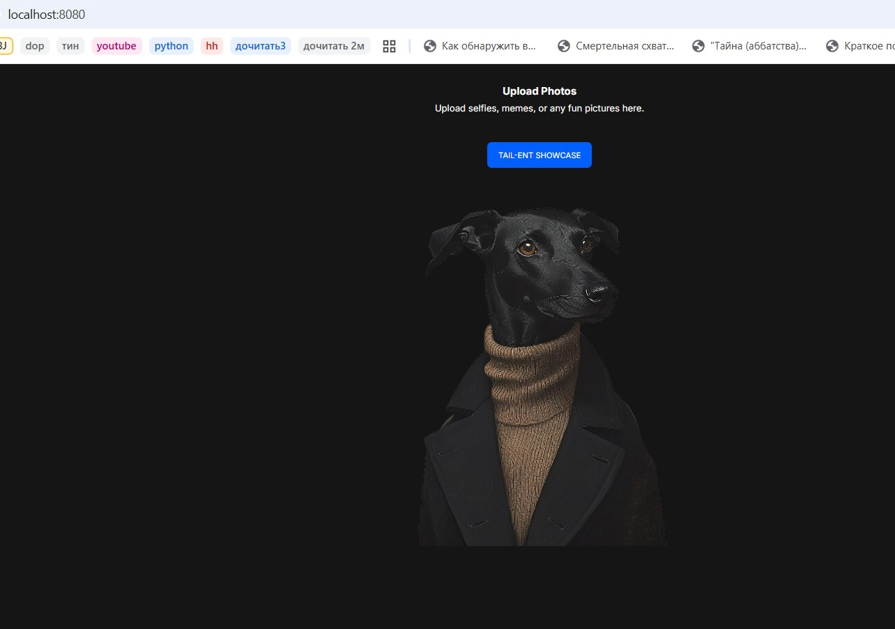
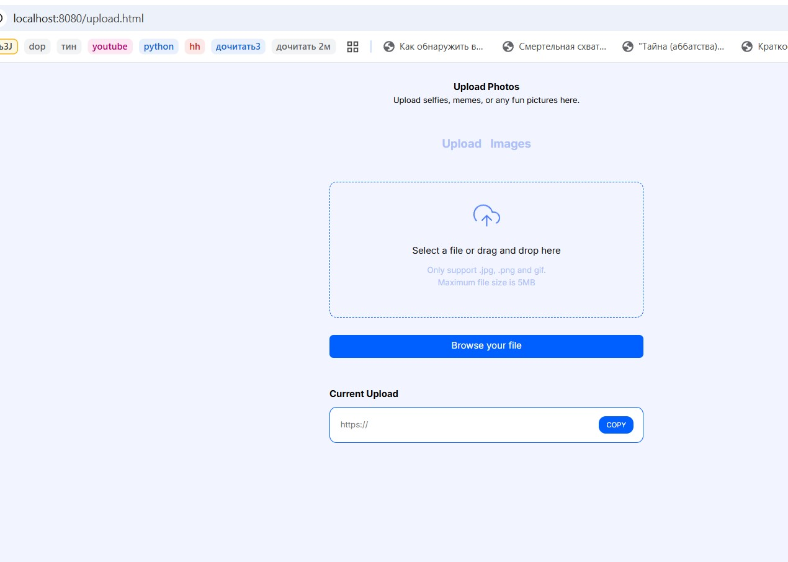
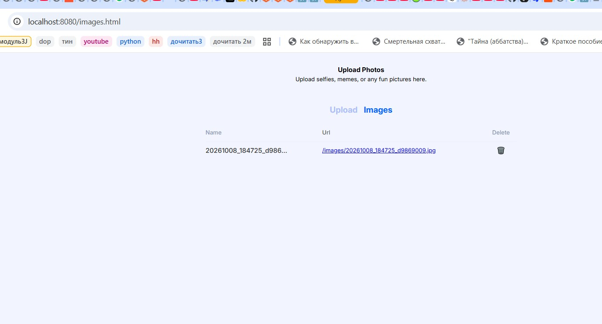
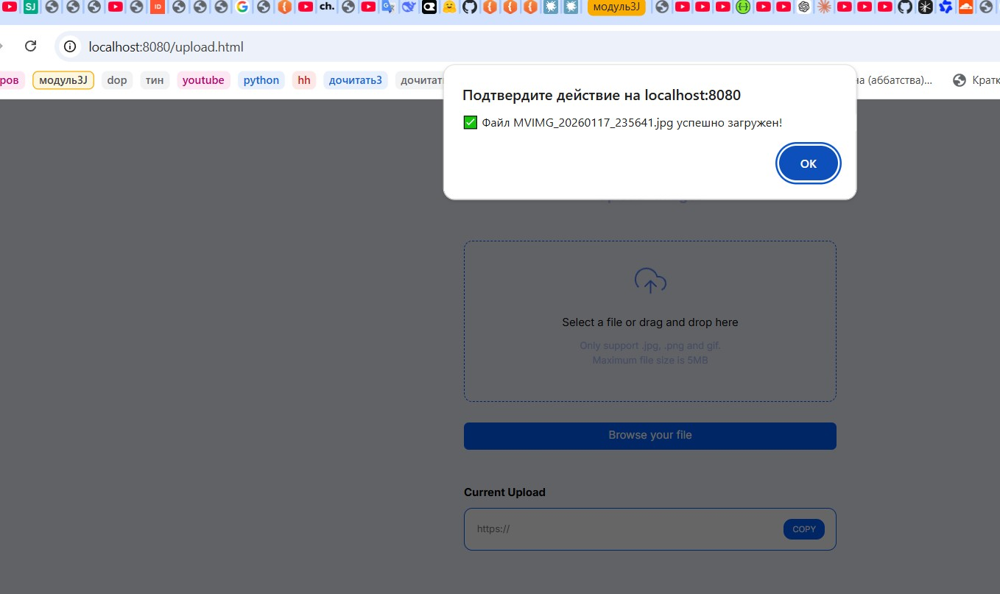

# 🖼️ Сервер Картинок

Простой и надежный сервис для загрузки, хранения и раздачи изображений.


## ✨ Возможности

- 📤 **Загрузка изображений** — JPG, PNG, GIF (до 5 МБ)
- 🔗 **Прямые ссылки** — уникальный URL для каждого файла
- ⚡ **Быстрая раздача** — Nginx отдаёт статику
- 📊 **Логирование** — все действия пишутся в `logs/app.log`
- 🐳 **Docker** — запуск одной командой
- 📦 **Docker Volumes** — данные сохраняются между перезапусками
- 🔒 **Безопасность** — валидация форматов, MIME-типов и размеров

## 📸 Скриншоты
### 🏠 Главная страница

Стильная главная с приветствием, примерами картинок и кнопкой перехода к загрузке.



### 📤 Страница загрузки

Форма с drag-and-drop: перетащите файл или выберите через кнопку.



### 🖼️ Список загруженных изображений

Таблица со всеми загруженными картинками и прямыми ссылками.



### ✅ Результат загрузки

После успешной загрузки — прямая ссылка готова к копированию.



## 🛠️ Технологии

| Компонент | Технология |
|-----------|-----------|
| Бэкенд | Python 3.12 (стандартная библиотека `http.server`) |
| Веб-сервер | Nginx (Alpine) |
| Контейнеризация | Docker + Docker Compose |
| Хранилище | Docker Volumes |
| Фронтенд | HTML, CSS, Vanilla JavaScript |

## 🚀 Быстрый старт

### Требования
- Docker 24.0+
- Docker Compose 2.20+
- **Git**

### Установка и запуск

1. Клонируйте репозиторий:
    ```bash
    git clone https://github.com/your-repo/image-server.git
    cd image-server

Запустите сервисы:

    bash
    docker-compose up --build

2.Откройте в браузере:

| Что | Адрес |
|-----|-------|
| 🏠 Главная | http://localhost:8080 |
| 📤 Загрузка | http://localhost:8080/upload.html |
| 🖼️ Список файлов | http://localhost:8080/images.html |
| 🔧 API (отладка) | http://localhost:8000 |

## 📁 Структура проекта

    Python-Image-Server-Rush/
    │
    ├── .gitignore
    ├── .dockerignore
    ├── README.md        
    ├── Dockerfile             # Docker образ бэкенда
    ├── docker-compose.yml     # Оркестрация контейнеров
    ├── nginx.conf             # Настройки Nginx
    ├── requirements.txt       # Python зависимости
    ├── app.py                 # Основной бэкенд
    ├── main.py
    ├── screenshots/               
    │
    ├── static/                # Статические файлы
    │   ├── index.html
    │   ├── upload.html
    │   ├── images.html
    │   ├── css/
    │   │   ├── reset.css
    │   │   └── style.css
    │   ├── js/
    │   │   ├── index.js
    │   │   ├── upload.js
    │   │   └── images.js
    │   └── img/
    ├── images/                # Volume для изображений
    └── logs/                  # Volume для логов


## 🔌 API

| Метод | Маршрут | Описание |
|-------|---------|----------|
| `GET` | `/` | Главная страница |
| `GET` | `/upload` | Форма загрузки |
| `POST` | `/upload` | Загрузка изображения |
| `GET` | `/images/<filename>` | Просмотр изображения (Nginx) |
| `GET` | `/images/help` | Инструкция по просмотру |

### Пример загрузки через curl
    bash
    curl -X POST -F "image=@photo.jpg" http://localhost:8080/upload
    Ответ:
    
    json
    {
      "success": true,
      "filename": "20250124_143022_a1b2c3d4.jpg",
      "url": "/images/20250124_143022_a1b2c3d4.jpg",
      "message": "Изображение успешно загружено"
    }
## 📊 Логирование

Логи сохраняются в файл logs/app.log: 

```
[2026-10-08 17:40:37] INFO: Сервер запущен на http://0.0.0.0:8000
[2026-10-08 17:41:12] INFO: Успех: изображение 20261008_174112_a1b2c3d4.jpg загружено
[2026-10-08 17:42:05] ERROR: Ошибка: неподдерживаемый формат файла (file.txt)
```

Посмотреть логи:

```bash
# Через Docker
docker compose logs -f app

# Через файл
type logs\app.log              # Windows
cat logs/app.log               # Linux/Mac
```

## 🛑 Остановка

```bash
# Мягкая остановка (Ctrl+C в терминале docker compose up)

# Через терминал
docker compose down

# Полная остановка с удалением volumes (УДАЛИТ все картинки и логи!)
docker compose down -v
```

## 🔒 Безопасность

- Валидация MIME-типов (`image/jpeg`, `image/png`, `image/gif`)
- Валидация расширений (`.jpg`, `.jpeg`, `.png`, `.gif`)
- Ограничение размера (5 МБ)
- Генерация уникальных имён (UUID)
- Работа от непривилегированного пользователя в Docker
- Nginx — единая точка входа для пользователей
- Прямой доступ к `/images/` отключён (только по ссылкам)

## 📝 Технические детали
Бэкенд: Python 3.12 (стандартная библиотека)

Веб-сервер: Nginx Alpine

Контейнеризация: Docker + Docker Compose

Хранилище: Docker Volumes

## 📄 Лицензия
MIT

